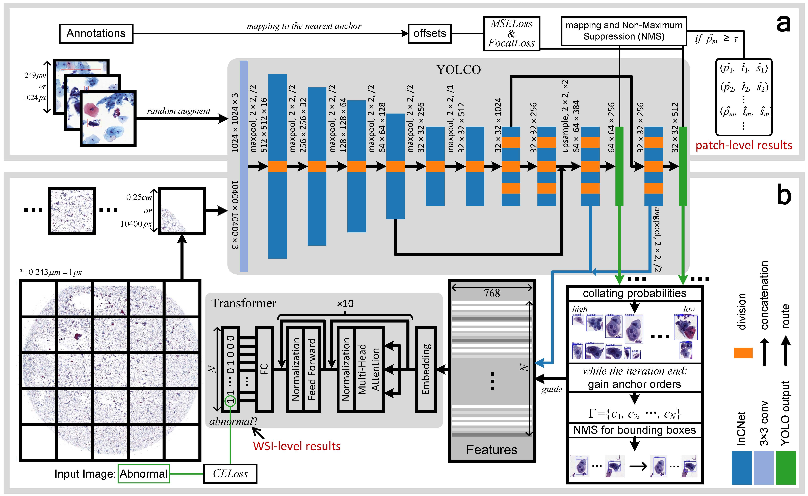

# You-Only-Look-Cytopathology-Once

### <font color='red'> News: </font> 
 - The speed is `55.9s` for the inference of a WSI has 4,089,446,400 RGB pixels (`63,949 x 63,949 x 3`) in our cpp release version ! 
```
OS: Ubuntu 21.04
GPU: NVIDIA GeForce 1080Ti (11177 MB)
CPU: Intel(R) Core(TM) i7-7820X CPU @ 3.60GHz (16 cores)
RAM: 94 GB
```

Codes Available of a Under review Paper, An Efficient Cervical Whole Slide Image Analysis Framework Based on Multi-scale Semantic and Location Deep Features. [arXiv:2106.15113](https://arxiv.org/abs/2106.15113)

Example of feature maps can be found here: [Colab](https://colab.research.google.com/drive/1-qvoLT18kf_6Of8BpaMfCvxvwfeyy1sw?usp=sharing)

- [x] Patch level classification `cls-patch-level/`
- [x] Patch level detection `det-patch-level/`
- [x] Qualitative results `qualitative-results/`
- [x] WSI level classification `cls-WSI-level/`
- [x] WSI level feature extraction `det-WSI-level/`
- [x] Models available - See `det-WSI-level/README.md`
- [x] C++ release version `cpp/`
- [ ] Data available

## Graphic Abstract


