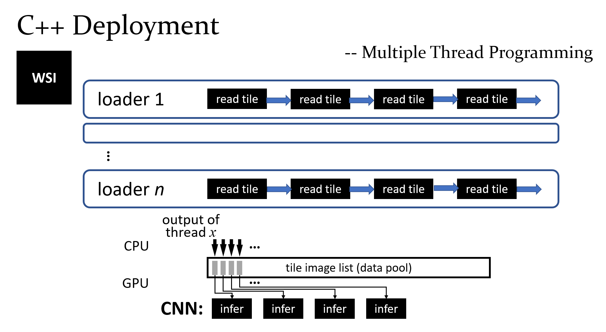

# C++ Deployment

OS: 
 - Linux

Dependencies:
 - Libtorch
 - Libtorchvision (CPU)
 - openslide

## Quick Start
```
build/main \
--detector /path/to/detector.pt \
--classifier /path/to/classifier.pt \
--input_side 5120 \
--verbose \
"/path/to/WSI1" \
["/path/to/WSI2" "/path/to/WSI3" ...]
```

## Install
Please install `openslide` at first. Let `PackageConfig` can find `openslide.pc`.
```
mkdir build
cd build
cmake -DCMAKE_INSTALL_PREFIX=\path\to\Libtorch -DCMAKE_INSTALL_PREFIX=\path\to\Libtorchvision ..
cmake --build ..
```

## Usage
```
Usage: main [options] input_slides 

Positional arguments:
input_slides                    list of input slide path

Optional arguments:
-h --help                       shows help message and exits [default: false]
-v --version                    prints version information and exits [default: false]
-s --input_side                 side length of input tile image [default: "5120"]
-c --classifier                 classifier's path [default: "../get_model_cpp/classifier_transformer_input1x100x768.pt"]
-d --detector                   detector's path [default: "../../model_zoo/detector_yolox_l_input1x3x5120x5120.pt"]
-cthr --classifier_thres        set classifier conf thres [default: "0.184"]
--thread_num                    thread number for data loader [default: "4"]
--feature_num                   feature sequence number to classifer (need to be the same as classifier's input size) [default: "100"]
-o --output_dir                 specify the output dir. [default: "./outputs/"]
-dthr --detector_thres          set detector conf thres [default: "0.5"]
-nmsthr --nms_thres             set nms iou thres [default: "0.1"]
-nclass --num_class             num_class [default: "1"]
--normalize                     normalize the input image (unused in yolco) [default: false]
--half                          half precision [default: false]
--only_det                      do only the detection [default: false]
--save_feature                  save the feature sequence of WSI [default: false]
--verbose                       display the verbose info [default: false]
```

## Avaliable Models:
https://drive.google.com/drive/folders/1UoMeYe5coWmgXjRIpHEbuOJ84PaC6AJL?usp=sharing

Programming:

